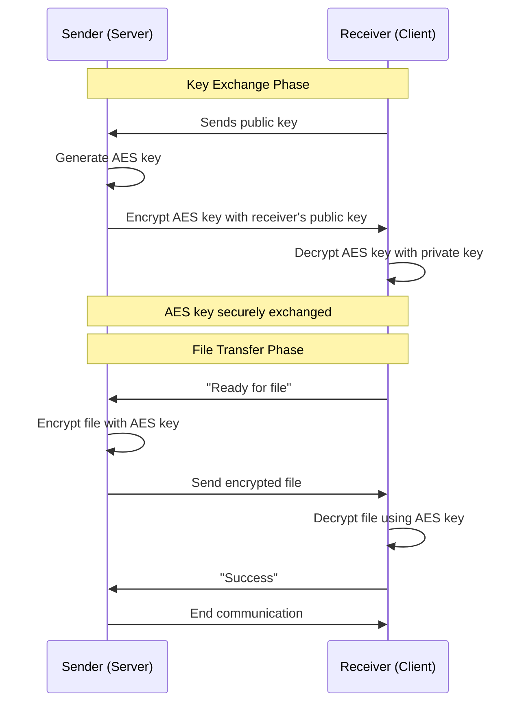

# Encrypted File Transfer Platform with Digital Signatures

[](https://www.python.org/downloads/)  [](LICENSE)    

## Introduction
The **Secure File Sharing System** is a Python-based application that combines **network programming** and **modern cryptography** to enable confidential, authenticated file transfers over untrusted networks.  

The system demonstrates how to integrate:  
- **Low-level socket programming** for peer-to-peer and client-server communication  
- **Hybrid cryptography** (RSA for key exchange, AES for data encryption, RSA/DSA for digital signatures)  
- **Concurrent server design** using threading and SQLite for scalable session and metadata management  
- **Custom security protocols** for key distribution, file encryption, and integrity verification  

This project goes beyond a simple file transfer utility, it illustrates how secure communication systems are engineered from the ground up. It is intended both as a practical tool and as a learning resource for topics in **secure networking, distributed systems, and applied cryptography**.

---

## Features
- Peer-to-peer tamper-proof file transfer over TCP sockets
- Live download progress bar
- Supports files of any size
- Secure hybrid cryptography (RSA + AES)  
- Digital signatures for authenticity and integrity  
- Concurrent authoritative indexing server with SQLite backend  
- Custom socket protocols for encrypted file sharing

---

## Requirements
[Download Python 3](https://www.python.org/downloads/)
 
---

## Dependencies:
Install the following Python dependencies:
```bash
pip install -r requirements.txt
```

---

## Installation Instructions

Clone the project to your local machine using Git.

```bash
git clone https://github.com/NickPrivate/Secure-File-Sharing
```

---

## Usage

1. **Start the Indexing Server**:
   - Navigate to the `Server` directory and run `server.py`
   ```bash
   cd src/Server
   python server.py
   ```
2. **Start User 1 (sender)**:
   - Navigate to `user1` inside the `test` directory and run `client.py`
   ```bash
   cd test/user1
   python client.py
   ```
3. **Start User 2 (receiver)**:
   - Navigate to `user2` inside the `test` directory and run `client.py`
   ```bash
   cd test/user2
   python client.py
   ```
---

## Project Overview

### Low-Level Sockets Programming
This project involves both the indexing server and Peer-to-Peer (P2P) file transfer using Python sockets. The implementation covers:
- Establishing TCP connections
- Handling multiple connections concurrently using threading
- Custom protocols for file transfer and communication

### Cryptographic Principles
The project incorporates several cryptographic techniques to ensure secure file transfer:
- **Asymmetric Encryption (RSA)**: Used for encrypting the AES key and verifying digital signatures.
- **Symmetric Encryption (AES)**: Used for encrypting the file contents.
- **Digital Signature (RSA/DSA)**: Used for verifying the integrity and authenticity of the transferred files.

### Concurrent Server and Database
The indexing server is designed to handle multiple peer connections simultaneously. It uses:
- **SQLite** for managing file metadata and user information.
- **Threading** for handling concurrent connections and database operations.

### Secure Key Distribution and Encrypted File Transfer
The project implements a secure key distribution mechanism and encrypted file transfer protocol:
- **Key Distribution**: AES key and nonce are encrypted with the receiver's RSA public key.
- **File Encryption**: The file is encrypted using AES.
- **File Transfer**: Custom socket protocols are used for transmitting the encrypted file and keys.

---

## Security Protocols

### Key Distribution
1. **Initial Key Exchange**:
   - Sender and receiver exchange their public RSA/DSA keys.
2. **AES Key Generation**:
   - The sender generates an AES key and a nonce.
3. **Encryption of AES Key**:
   - The AES key and nonce are encrypted using the receiver's public RSA key.
4. **Transmission**:
   - The encrypted AES key and nonce are sent to the receiver.
5. **Decryption**:
   - The receiver decrypts the AES key and nonce using their private RSA key.

### File Encryption and Integrity Verification
1. **File Encryption**:
   - The file is encrypted using the AES key and nonce.
2. **Digital Signature**:
   - The sender generates an RSA/DSA signature for the encrypted file.
3. **Transmission**:
   - The encrypted file and signature are sent to the receiver.
4. **Decryption**:
   - The receiver decrypts the file using the AES key.
5. **Integrity Verification**:
   - The receiver verifies the file's integrity using the RSA/DSA signature. If verification fails, the download is canceled; if it succeeds, the file is downloaded.
  
## Secure File Transfer Workflow



## Contributors
- **Nick Goulart** - Creator and maintainer

---

## License
This project is licensed under the MIT License - see the [LICENSE](LICENSE) file for details.

